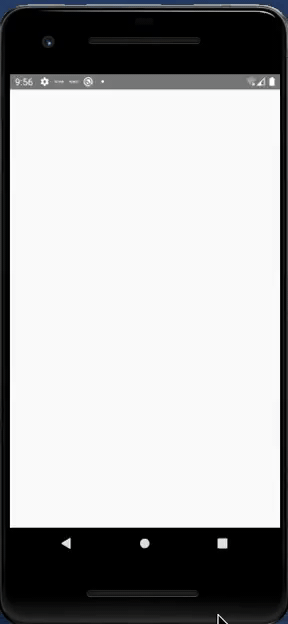

# Skeleton for screen loading

## About

A simple demo using this skeleton component I created to use in my projects simuling content while loading the screen.

## How to use

- The skeleton component is in the 'src/components/skeleton' folder and as Icreated the screen load on the homepage at 'src/screens/home/components/homeLoading' folder.
- When using component you can send props to dimensions the width and height and margin horizontal and vertical as array and rounded border.

Example

```
import Skeleton from 'src/components/skeleton'

<Skeleton dimensions={[300, 40]} margin={[0, 0]} circle={5} />
```



## Project References

[Creating a new application React Native](https://reactnative.dev/docs/environment-setup#creating-a-new-application)
[React Native - Animated](https://reactnative.dev/docs/animated)
[React Native - Flatlist](https://reactnative.dev/docs/flatlist)
[Styled Components](https://styled-components.com/)
